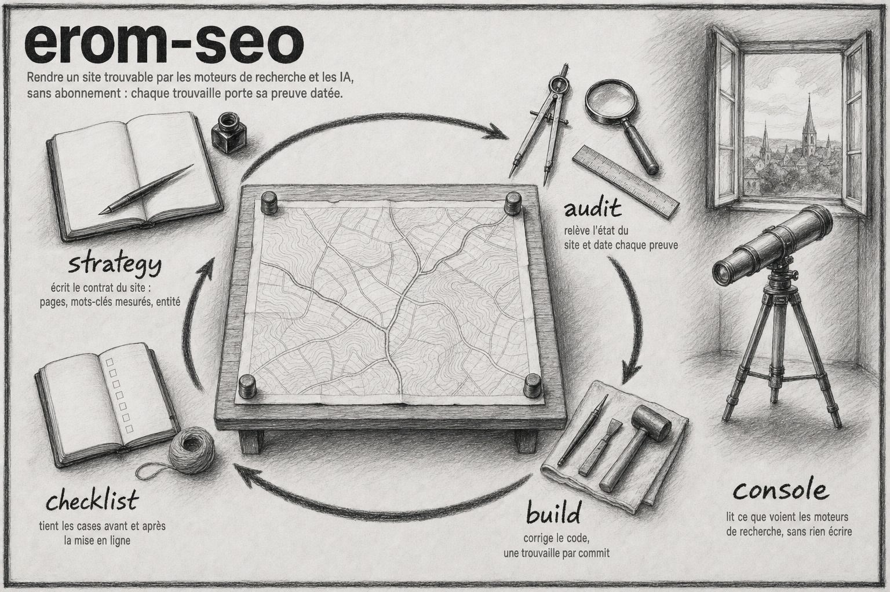

# erom-agence-seo



Le dépôt de l'agence SEO/GEO : le plugin Claude Code `erom-seo` et les dossiers des sites qu'il suit.

Cinq skills, sans abonnement tiers. Chaque vérification cite la documentation officielle du moteur concerné, mot pour mot, et chaque trouvaille cite sa preuve dans la collecte. Rien ne s'affirme sans être daté et sourcé.

| Skill | Ce qu'il fait |
|---|---|
| `strategy` | L'interview qui produit `seo/strategy.md`, le contrat du site : pages, mots-clés mesurés chez Bing et Wikipédia, entité, cadence de fraîcheur |
| `audit` | Le relevé daté d'un site, de sa seule URL jusqu'à son code lancé en local. Collecte brute conservée, rapport Markdown en français |
| `build` | La correction du code, un commit par trouvaille, jusqu'à ce qu'un audit frais n'ait plus ni Critique ni Important |
| `checklist` | Les quinze cases avant et après la mise en ligne, chacune avec sa preuve, plus les jalons J+1 à J+90 |
| `console` | La lecture directe de Search Console et de Bing Webmaster Tools depuis le terminal, sans rien écrire |

## Démarrer

```bash
cd plugin && bun install
claude --plugin-dir /chemin/vers/erom-agence-seo/plugin
```

Puis, depuis le dossier d'un client ou depuis le repo d'un site :

```
/erom-seo:strategy
/erom-seo:audit https://acme.fr
```

Le détail de chaque skills, les clés d'API gratuites et les options : [`plugin/README.md`](plugin/README.md).

## Le dépôt

| Dossier | Contenu |
|---|---|
| `plugin/` | Le plugin `erom-seo` : les cinq skills, leurs scripts et leurs références |
| `clients/` | Un dossier par site suivi, avec sa stratégie, ses audits et sa checklist |
| `docs/` | Les recherches datées qui ancrent les vérifications, les specs et les plans |
| `_memory_/` | La cartographie du dépôt : architecture, fichiers clés, patterns, gotchas |
| `assets/` | La carte du plugin |

## Licence

MIT. L'attribution de la matière de départ est dans [`plugin/README.md`](plugin/README.md).
